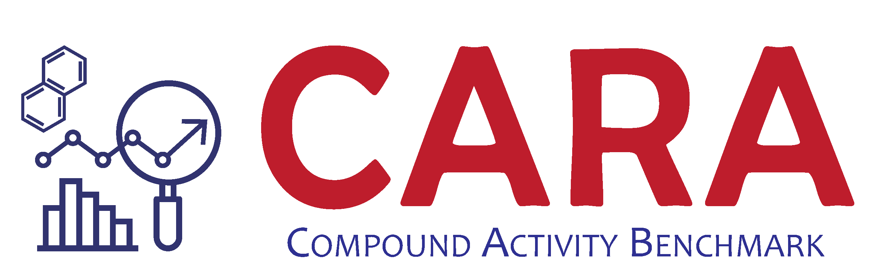
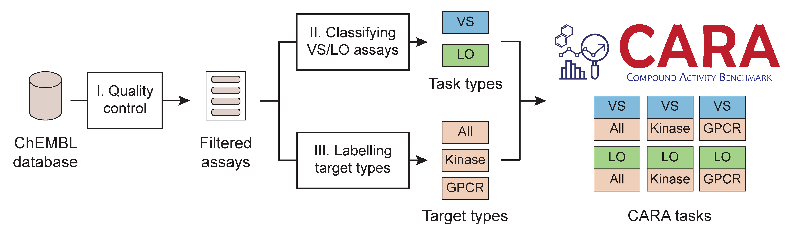
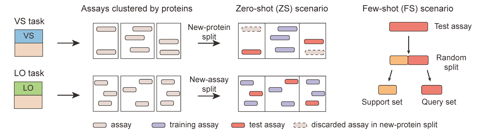
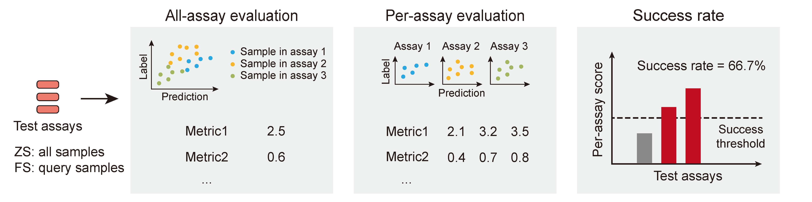

# CARA
[](https://zenodo.org/doi/10.5281/zenodo.11125010)
[](https://doi.org/10.5281/zenodo.11063965)

Benchmarking Compound Activity Prediction for Real-World Drug Discovery Applications




## 1. Introduction

CARA is a benchmark of compound activity prediction and evaluation for real-world applications.

### 1.1 Features of CARA

- **Real-world data**: CARA contains large-scale, high-quality, and real-world compound activity data measured by wet-lab experiments, which were collected from the ChEMBL database.
- **Assay-level organization**: CARA organizes the compound activities into assays (slightly different from ChEMBL assays), i.e., one assay, one target, one measurement type, many compounds.
- **Representative targets**: CARA selects representative protein targets for test, reducing the influence of long-tailed distribution of protein exposure.
- **Distinguished tasks**: CARA considers the compound activities from different stages, i.e., virtual screening (VS) or lead optimization (LO), of drug discovery seperately.
- **Diverse scenarios**: CARA provides the learning scenarios of both zero-shot (ZS) and few-shot (FS).
- **Regression objective**: CARA adopts a regression task without defining a threshold for positive and nagative samples.
- **Assay-level evaluation**: CARA evaluates the compound activity prediction models at the assay level, preventing the bulk evaluation bias.
- **Specific metrics**: CARA evaluates VS and LO tasks in different metrics according to their distinct goals in practice. 
- **Success rates**: CARA defines success rates based on assay-level evaluations to provide direct understanding of performances.
- **Informative leaderboard**: CARA provides the performance comparison of selected state-of-the-art methods for compound activity prediction.

### 1.2 Tasks



CARA defines six tasks with two task types and three target types.
The two task types are virtual screening (VS) and lead optimization (LO).
The VS task focuses on screening hit compounds for specific target from a compound library with diverse scaffolds.
The LO task tries to optimize a compound to those that have better activities.

The three target types are All, Kinase, and G-protein coupled receptor (GPCR).

As a result, the six tasks are VS-All, VS-Kinase, VS-GPCR, LO-All, LO-Kinase, and LO-GPCR.

We suggest use VS-All and LO-All for performance evaluation and comparison (see our manuscript for more details).

### 1.3 Train-test splitting schemes



The train-test splitting is conducted at the assay level, i.e., training assay and test assay. We also make sure that there is no data leakage.

For the **VS** task, we use **new-protein** splitting scheme such that the protein targets in the test assays were not seen during training.

For the **LO** task, we use **new-assay** splitting scheme such that the congeneric compounds in the test assays were not seen during training.


### 1.4 Few-shot scenario

For FS scenario, the samples in the test assays are further splitted into support samples and query samples.
Therefore, you can use the support samples for training or fine-tuning.
In this case, the query samples are used for evaluation.

### 1.5 Evaluation metrics



For the **VS** task, we care more about the accuracy of top ranking compounds, therefore, we mainly use enrichment factors.

- **EF@1%**: Enrichment factor at top 1%. The hit compounds are defined as those with top 1% highest activities.

- **EF@5%**: Enrichment factor at top 5%. The hit compounds are defined as those with top 5% highest activities.

- **SR@1%**: Success rate at top 1%. The hit compounds are defined as those with top 1% highest activities. Success: at least one hit compound ranked at the top 1% of the list by predicted scores.

- **SR@5%**: Success rate at top 5%. The hit compounds are defined as those with top 5% highest activities. Success: at least one hit compound ranked at the top 5% of the list by predicted scores.

For the **LO** task, we need the overall rankings of the compounds, therefore we use correlation coefficients.

- **PCC**: Pearson's correlation coefficient.

- **SCC**: Spearman's correlation coefficient.

- **SR@0.5**: Success rate with PCC > 0.5. Success: PCC > 0.5.

### 1.6 Statistics

| Task | VS-All | VS-Kinase | VS-GPCR | LO-All | LO-Kinase | LO-GPCR |
|--|--|--|--|--|--|--|
| #Assays | 12,029 | 2,733 | 2,256 | 81,187 | 11,276 | 22,917 |
| #Proteins | 2,242 | 434 | 268 | 4,456 | 487 | 579 |
| #Compounds | 317,855 | 25,943 | 41,352 | 625,099 | 111,279 | 161,263 |
| #Samples | 1,237,256 | 84,605 | 70,179 | 1,187,136 | 200,800 | 321,904 |
| #Training assays | 9,408 | 1,459 | 1,584 | 81,033 | 11,220 | 22,872 |
| #Test assays | 100 | 58 | 18 | 100 | 54 | 43 |


## 2. Code for Training and Evaluation

We provide the code for model training and performance evaluation based on CARA.
You can install the following packages to run the code, the installation time may cost a few minutes to several hours.
The training may cost several hours to a few days for different tasks, dataset sizes, or methods.

### 2.1 Requirements

```
python=3.7.11
pandas=1.3.5
numpy=1.21.5
scipy=1.7.3
json=2.0.9
scikit-learn=1.0.2
pytorch=1.12.1
torch-geometric=2.2.0
rdkit=2020.09.1.0
gensim=3.8.3
networkx=2.6.3
subword_nmt=0.3.8
codecs
```

### 2.2 General train, pre-train

```
python -u runTrain.py --model [MODEL] --dataset_params task:[TASK],subset:[SUBSET] --info [INFO] --gpu [GPU]
```
- ```MODEL```: model name, e.g., DeepConvDTI
- ```TASK```: task name, e.g., VS_All
- ```SUBSET```: subset of data, e.g., train, support
- ```INFO```: mark for training, e.g., fastTrain, begin with 'fast' will print less to speed up
- ```GPU```: gpu number, e.g., 0

### 2.3 Meta-train
```
python -u runTrain.py --model [MODEL]Meta --dataset_params task:[TASK],subset:[SUBSET],n_way:[N_WAY],k_shot:[K_SHOT] --info [INFO] --gpu [GPU]
```
- ```N_WAY```: number of assays per batch, e.g., 1
- ```K_SHOT```: number of support samples per assay, e.g., 50


### 2.4 General test
```
python -u runTest.py --model [MODEL] --model_path [MODEL_PATH] --dataset_params task:[TASK],subset:[SUBSET] --info [INFO] --gpu [GPU]
```
- ```MODEL```: model name, e.g., DeepConvDTI
- ```MODEL_PATH```: folder to the trained models
- ```TASK```: task name, e.g., VS_All
- ```SUBSET```: subset of data, e.g., test, query
- ```INFO```: mark for training, e.g., test, 
- ```GPU```: gpu number, e.g., 0

### 2.5 Fine-tune, meta-test
```
python -u runTest.py --model [MODEL]Meta ---model_path [MODEL_PATH] --dataset_params task:[TASK],subset:finetune,step:[STEP],shot:[SHOT] --info [INFO] --gpu [GPU]
```
- ```STEP```: number of steps for fine-tuning, e.g., 10000
- ```SHOT```: number of support samples per assay for fine-tuning, e.g., 50


## 3. Leaderboard

### 3.1 Leaderboard of the VS-All task under the ZS scenario 

| Method | EF@1% | SR@1% (%) | EF@5% | SR@5% (%) |
|---|---|---|---|---|
| DeepConvDTI       | **9.48 ± 1.22**	| **39.40 ± 2.73**	| **3.22 ± 0.24**	| **81.60 ± 2.87** |
| DeepDTA        	| **8.76 ± 1.56**	| **36.00 ± 3.52**	| **3.37 ± 0.43**	| **83.40 ± 2.87**	|
| DeepCPI           | **7.73 ± 0.34**	| 31.80 ± 1.94	| 2.95 ± 0.22	| **78.60 ± 2.65**|
| MONN           	| 7.08 ± 0.64	| 33.00 ± 2.68	| 2.70 ± 0.47	| 76.00 ± 4.15	|
| Tsubaki        	| 6.09 ± 1.30	| 30.60 ± 2.80	| 2.53 ± 0.14	| 79.20 ± 2.86	|
| TransformerCPI 	| 5.60 ± 0.65	| 28.20 ± 3.06	| 2.46 ± 0.29	| 78.00 ± 2.53	|
| MolTrans       	| 5.61 ± 0.90	| 29.60 ± 2.80	| 2.20 ± 0.13	| 74.00 ± 1.79	| 
| GraphDTA       	| 4.70 ± 0.88	| 24.40 ± 1.96	| 1.88 ± 0.21	| 70.80 ± 4.07	| 


### 3.2 Leaderboard of the LO-All task under the ZS scenario 
| Method | SCC | PCC | SR@0.5 (%) |
|---|---|---|---|
| DeepConvDTI       | **0.30 ± 0.01**   | **0.31 ± 0.01**	| **26.60 ± 2.15** |
| DeepDTA        	| **0.28 ± 0.01**   | **0.30 ± 0.01**	| 22.40 ± 1.36 |
| DeepCPI           | 0.24 ± 0.01	| 0.25 ± 0.01	| 16.00 ± 0.63 |
| MONN           	| 0.25 ± 0.01	| 0.27 ± 0.01	| 15.40 ± 2.24 |
| Tsubaki        	| 0.19 ± 0.02	| 0.19 ± 0.01	| 9.40 ± 1.62 |
| TransformerCPI 	| 0.19 ± 0.01	| 0.19 ± 0.02	| 8.00 ± 2.90 |
| MolTrans       	| 0.20 ± 0.01	| 0.20 ± 0.02	| 12.20 ± 1.47 |
| GraphDTA       	| 0.22 ± 0.01	| 0.24 ± 0.01	| 15.20 ± 2.04 |


### 3.3 Leaderboard of the VS-All task under the FS scenario 


| Strategy | Method | EF@1% | SR@1% (%) |
|---|---|---|---|
| Pre-training                  | DeepCPI        	| 7.96 ± 0.82	| 29.80 ± 1.47	|
| Pre-training                  | DeepDTA        	| 9.17 ± 1.53	| 34.20 ± 4.26	|
| Pre-training                  | DeepConvDTI    	| 9.14 ± 1.28	| 35.40 ± 2.87	|
| QSAR                          | RF             	| 7.83 ± 0.49	| 28.40 ± 0.80	| 
| QSAR                          | GBT            	| 7.90 ± 0.52	| 29.60 ± 1.02	| 
| QSAR                          | SVM            	| 6.29 ± 0.00	| 28.00 ± 0.00	| 
| QSAR                          | DNN            	| 8.82 ± 0.39	| 27.60 ± 0.80	| 
| Pre-training and fine-tuning  | DeepCPI        	| 9.92 ± 0.86	| 32.80 ± 1.17	| 
| Pre-training and fine-tuning  | DeepDTA        	| **13.02 ± 3.26**	| **41.20 ± 5.19**	| 
| Pre-training and fine-tuning  | DeepConvDTI    	| 11.17 ± 1.94	| 36.80 ± 2.64	| 
| Meta-learning                 | DeepCPI-c      	| 11.85 ± 2.20	| 36.60 ± 2.73	| 
| Meta-learning                 | MTDNN          	| **12.76 ± 0.37**	| 41.60 ± 1.20	| 
| Meta-learning                 | DeepConvDTI-c  	| **15.67 ± 1.66**	| **44.60 ± 4.13**	| 
| Multi-task learning           | MTDNN          	| 4.20 ± 1.58	| 25.20 ± 4.75	| 
| Multi-task learning           | DeepConvDTI-c  	| **15.95 ± 1.77**	| **45.20 ± 1.72**	|
| Re-training                   | DeepCPI        	| **13.29 ± 1.34**	| **41.20 ± 2.93**	| 
| Re-training                   | DeepDTA        	| 11.81 ± 2.08	| **39.00 ± 3.41**	| 
| Re-training                   | DeepConvDTI    	| **13.28 ± 0.59**	| **42.80 ± 1.72**	| 

### 3.4 Leaderboard of the LO-All task under the FS scenario 

| Strategy | Method | PCC | SR@0.5 (%) |
|---|---|---|---|
| Pre-training                  | DeepCPI        	| 0.26 ± 0.01	| 16.60 ± 1.02 |
| Pre-training                  | DeepDTA        	| 0.30 ± 0.01	| 24.00 ± 1.67 |
| Pre-training                  | DeepConvDTI    	| 0.32 ± 0.01	| 28.60 ± 1.85 |
| QSAR                          | RF             	| 0.55 ± 0.00	| 58.20 ± 1.72 |
| QSAR                          | GBT            	| 0.54 ± 0.00	| 57.80 ± 1.17 |
| QSAR                          | SVM            	| **0.57 ± 0.00**	| **65.00 ± 0.00** |
| QSAR                          | DNN            	| 0.54 ± 0.00	| 61.20 ± 1.72 |
| Pre-training and fine-tuning  | DeepCPI        	| 0.33 ± 0.01	| 18.80 ± 0.40 |
| Pre-training and fine-tuning  | DeepDTA        	| 0.49 ± 0.01	| 51.00 ± 1.79 |
| Pre-training and fine-tuning  | DeepConvDTI    	| 0.39 ± 0.01	| 32.40 ± 1.36 |
| Meta-learning                 | DeepCPI-c      	| 0.42 ± 0.02	| 37.40 ± 3.44 |
| Meta-learning                 | MTDNN          	| 0.46 ± 0.04	| 42.26 ± 6.92 |
| Meta-learning                 | DeepConvDTI-c  	| 0.55 ± 0.01	| **62.80 ± 4.07** |
| Multi-task learning           | MTDNN          	| 0.48 ± 0.00	| 48.20 ± 1.60 |
| Multi-task learning           | DeepConvDTI-c  	| **0.58 ± 0.00**	| **65.40 ± 2.06** |
| Re-training                   | DeepCPI        	| 0.44 ± 0.00	| 43.89 ± 2.91 |
| Re-training                   | DeepDTA        	| 0.46 ± 0.01	| 45.80 ± 1.72 |
| Re-training                   | DeepConvDTI    	| 0.50 ± 0.01	| 54.40 ± 1.96 |
